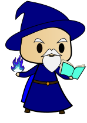
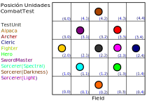

*Metodologías de Diseño y programación*

# Alpaca Emblem

Juego de estrategia por turnos. Dos equipos formados por distintos tipos de unidades se enfrentan en un mapa. El objetivo del juego es dejar fuera de combate a una unidad especial del equipo contrario, llamada *Héroe*. Las unidades pueden equipar distintos ítems, y utilizarlos durante el combate. Los ítems tienen debilidades y fortalezas entre ellos.

## Reglas

### Unidades
Actualmente el juego cuenta con 6 tipos de unidades, las cuales comparten las siguientes características:
- **Hit points:** Es la cantidad de daño que puede recibir la unidad antes de quedar fuera de combate (i.e. la unidad no puede seguir utilizándose y deja el campo de juego). Para esto, se tienen 2 contadores: uno que indica
los hit points máximos de la unidad, y otro que indica la cantidad actual.
- **Movement:** Representa la cantidad máxima de celdas del mapa que puede desplazarse una unidad. Esto significa
que en cada turno una unidad puede ubicarse en cualquier posición del mapa que se encuentre entre 0
y *movement* celdas de distancia desde su sitio actual.
- **Location:** Es la ubicación actual de una unidad en el mapa.
- **Items:** Es una lista con los objetos que porta la unidad. Además, dependiendo del tipo de objeto, algunas unidades podrán equiparse alguno de estos.

Exceptuando la Alpaca, todas las unidades pueden portar a lo más 3 objetos.
Los tipos de unidades se listan a continuación:
- Unidades básicas:
  - **Archer:** Sólo pueden equiparse *Bows*.  
  - **Fighter:** Sólo pueden equiparse *Axes*. 
  - **Sword Master:** Sólo pueden equiparse *Swords*. 
  - **Sorcerer:** Sólo pueden equiparse *Magic Books*. 
- Unidades especiales:
  - **Alpaca:** No pueden equiparse ningún tipo de objeto, pero pueden cargar una cantidad ilimitada de ellos. 
  - **Cleric:** Sólo pueden equiparse *Staffs* y no pueden realizar ataques. 
  - **Hero:** Sólo puede equiparse *Spears*. Al ser derrotado, el jugador que perdió esta unidad pierde la partida (esto no está implementado aún).

### Objetos
Los objetos son elementos que una unidad puede ocupar sobre otra. Para ocupar un objeto, la unidad primero debe equipárselo. Cada objeto tiene un rango definido en [*minRange*, *maxRange*] y sólo pueden utilizarse en unidades que estén dentro de ese rango. El rango de un objeto está acotado inferiormente por 0 y el máximo debe ser estrictamente mayor que el mínimo.

Los ítems disponibles son:
- **Axe:** Solo puede ser equipado por *Fighter*. Puede atacar y contratacar.
- **Bow:** Solo puede ser equipado por *Archer*. Puede atacar y contratacar, pero no pueden tener un rango menor a 2 (i.e. no pueden atacar ni contratacar a unidades adyacentes).
- **Sword:** Solo puede ser equipado por *SwordMaster*. Puede atacar y contratacar.
- **Staff:** Solo puede ser equipado por *Cleric*. No puede atacar ni contratacar, pero puede curar daño a otras unidades.
- **Spear:** Solo puede ser equipado por *Hero*. Puede atacar y contratacar.
- **MagicBook:** Solo pueden ser equipados por un *Sorcerer*. Puede atacar y contratacar. 

### Mapa

### Combate
Una unidad puede utilizar el objeto que tiene equipado sobre otra unidad, siempre y cuando la esta se encuentre dentro del rango definido por el ítem. Cuando esto sucede se entra en un combate. Si el ítem usado puede atacar (i.e. puede realizar daño), entonces el oponente tiene la posibilidad de contratacar, lo que podrá hacer si él también tiene un ítem que pueda atacar (también tendrá que considerar el rango de su ítem). 
También hay ítems (como `Staff`) que no pueden realizar ataques, pero pueden sanar a otras unidades. Estos ítems no dan la posibilidad de realizar un contrataque, aunque tampoco podrán contratacar si son atacados.
Cuando un ítem ataca a otro, al calcular el daño se debe considerar las debilidades y fortalezas de los ítems.

| Item   | Débil contra | Fuerte contra |
| :---:    |    :----:    |         :---: |
| Axe  | Sword       | Spear |
| Sword | Spear        | Axe |
| Spear  | Axe        | Sword |

Existen 3 tipos de magia: *Light*, *Darkness* y *Spectral*, cada uno con sus propias debilidades y fortalezas.

| Item     | Débil contra | Fuerte contra |
| :---:    |    :----:    |         :---: |
| Spectral | Darkness     | Light         |
| Darkness | Light        | Spectral      |
| Light    | Spectral     | Darkness      |

Cuando un objeto es fuerte contra otro, su daño aumenta en 1.5 veces, mientras que si es débil contra otro, entonces su daño disminuye en 20 puntos.

Además de las tablas anteriores, los libros de magia son al mismo tiempo fuertes contra todas las armas no mágicas, y todas las armas no mágicas son fuertes contra los libros mágicos (e.g. si se ataca con libro de luz a una unidad que tenga espada, entonces realizará 1.5 veces su dañoo, pero también recibirá 1.5 veces el daño de la espada).

### Intercambio

Todas las unidades pueden dar y recibir objetos de otras, siempre y cuando estas estén a distancia 1 entre ellas y que no se supere la cantidad máxima de objetos que puede portar. *(Creo que no hice test para checker la distancia :C).*

### Mapa
El mapa se puede pensar como una grilla de dimensiones , en la que cada casilla puede ser parte del mapa o no.
Más específicamente, el campo de juego se define como un grafo en el que cada nodo representa una celda del mapa. Las celdas pueden estar o no conectadas a otras celdas. Una celda está conectada a otra si son adyacentes: por ejemplo, la celda  puede estar conectada con la , referenciándose la una a la otra como vecinas, pero no podría estar conectada con la celda .
La distancia entre todos los nodos que están directamente conectados es 1.

## Detalles de la Implementación
El modelo se separa en tres partes: unidades, ítems y mapa. Los diagramas UML con más detalle pueden verse en la carpeta [reportes/UML](reportes/UML)
### Unidades: `IUnit` 
A continuación se muestra un diagrama UML resumido (solo clases e interfaces) del paquete `units`.

### Ítems: paquete `items`
A continuación se muestra un diagrama UML resumido (solo clases e interfaces) del paquete `items`.

Se usa la interfaz `IEquipableItem` para describir el comportamiento de un ítem genérico. Esto se implementa en la clase abstracta `AbstractItem`. Esta tiene las subclases abstractas `AbstractHealer`, que describe el comportamiento de los ítems que pueden curar otras unidades (por ahora solo `Staff`), y `AbstractDamageItem`, que describe los ítems que pueden atacar. Debido a esta implementación, no es posible tener ítems que puedan atacar y curar.
Se cuenta además con las interfaces `IHealer` y `IAbleOfAttack` para las clases abstractas `AbstractHealer` y `AbstractDamageItem` respectivamente.

A su vez, el paquete `items` contiene los paquetes `magic` y  `nonMagic`. Ambos son vistos como una extensión de `AbstractDamageItem`, así que los ítems que sanan no se consideran mágicos ni no mágicos.
#### Ítems mágicos: paquete `items.magic`.
A continuación se muestra un diagrama UML resumido (solo clases e interfaces) del paquete `items.magic`.

Se tiene la interfaz `IMagicBook`, implementada por la clase abstracta `AbstracMagicBook`, la cual es subclaseada por las clases `DarknessBook`, `LightBook`, `SpectralBook`.
#### Ítems no mágicos: paquete `items.nonMagic`
A continuación se muestra un diagrama UML resumido (solo clases e interfaces) del paquete `items.nonMagic`.

Se tiene la interfaz `INonMagical`, implementada por la clase abstracta `AbstracWeapon`, la cual es subclaseada por la mayor parte de los ítems (`Bow`, `Axe`, etc).

### Comentarios
- Para distinguir los distintos tipos de ítems se utiliza Double Dispatch (para equipar los ítems y para atacar unidades).
- Se crea una clase `NullItem` (que no hace nada), que implementa la interfaz `IEquipableItem`. Se utiliza para tratar con las unidades que no tienen un ítem equipado. Tiene rango [0,0], y `power` 0.
- Las unidades no equipadas son vulnerables: recibirán daño aumentado. La Alpaca, por tanto, siempre recibe más daño. (Puedo dejarlo normal, pero ahora no alcanzo).
- Se tiene una interfaz `IEquipableItem`, que define el comportamiento de un ítem estándar. Esta se implementa en la clase abstracta `AbstractItem`. Esta clase, a su vez, se separa en dos clases abstractas `AbstractWeapon`, para ítems que pueden atacar y que pueden reaccionar a ataques con un contrataque (como `Bow` o `Axe`), y `AbstractHealer`, para ítems que pueden sanar, pero que no pueden contratacar (como `Staff`).   
- La muerte de las unidades no se alcanzó a implementar.

## Descripción de los tests

### Clase `AbstractModelTest`
Se creó una clase `AbstractModelTest` con métodos útiles para varios tests. Implementa un campo de batalla con todas las unidades disponibles, la mayoría a distancia 2 de una unidad de prueba `testUnit` (que cambiará en las diferentes extensiones de `AbstractTestUnit`). Las posiciones de las unidades se muestran en la imagen:

Se cuenta además con un ítem de cada tipo.
La implementa los siguientes métodos:
- `setField()` y `getField()`
- `setTestUnit()` y `getTestUnit()`
- `setTestItem()` y `getTestItem()`
- `setTargetUnits()`
- Getters para todas las unidades (`getAlpaca()`, etc)
- Getters para todos los ítems (`getBow()`, etc)
- `checkHPAfterUseItemOnUnitTest` revisa que los `currentHitPoints` de una unidad sean los esperados después de usar `testItem` en esa unidad.
- `strongDamageTest` revisa que una unidad haya recibido daño fuerte después de usar un ítem sobre ella.
- `normalDamageTest` revisa que una unidad haya recibido daño normal después de usar un ítem sobre ella.
- `weakDamageTest` revisa que una unidad haya recibido daño débil después de usar un ítem sobre ella.
- `zeroDamageTest` revisa que una unidad no haya recibido daño después de usar un ítem sobre ella.
- `equipUnit` añade un ítem al inventario de una unidad y trata de equiparlo.
- `equipTestUnit()` equipa a `testUnit` con `testItem`.
- `equipTargetUnits()` equipa a todas las unidades con si ítem correspondiente.
- `checkCorrectEquippedItemTest` trata de equipar un ítem a una unidad, y verifica que fue correctamente equipado.
- `checkIncorrectEquippedItemTest` trata de equipar un ítem a una unidad, y verifica que no fue equipado.

### Tests de `units`

#### Hit Points
- `isDeadTest()` verifica que la unidad se reconoce como muerta al tener 0 `hitPoints`.

#### Inventario
Test para el correcto manejo de los ítems en inventario.
- `addItemTest()` chequea que los ítems se agregan correctamente.
- `addItemMoreThanMaxTest()` chequea que no se agregan más ítems del máximo.

#### Equipar ítems correctamente
Se testea que cada una de las clases solo pueda equipar el tipo de ítem que le corresponde (e.g. `Archer` solo puede equipar `Bow`, etc). Se implementaron los siguientes tests.
- `equipAxeTest()`
- `equipSwordTest()`
- `equipSpearTest()`
- `equipStaffTest()`
- `equipBowTest()`

Su comportamiento depende de la clase. Se testea que las clases equipen exitosamente su ítem correspondiente, y que no hagan nada al intentar equipar un ítem incorrecto.

#### Intercambio
- `successfulExchange()` verifica que una unidad puede entregar un ítem de su inventario a otra que esté a distancia 1, y que el `owner` del ítem cambia.
- `notGiveAwayItemNotOwned()` verifica que no se pueda entregar un ítem que no está en el inventario.
- `notInRangeFailedExchange()` verifica que no es posible entregar un ítem del inventario a una unidad que no esté a distancia 1.

#### Movimiento
- `testMovement` verifica que una unidad no puede moverse a una celda que esté a una distancia mayor que su capacidad de movimiento, que es capaz de moverse a una celda válida, y que no se mueve a una celda ocupada por otra unidad.

#### Combate
La idea es que `testUnit` ataque (o sane, si el el caso) a todas las unidades a su alrededor.
- En el test `useItemOnUnEquippedTargetUnitsTest` ninguna unidad objetivo está equipada, por lo que deben recibir daño aumentado.
- El test `equipTargetsAndUseItemOnEquippedTargetUnitsTest`, las unidades objetivo son equipadas antes de ser atacadas. Se verifica que los `currentHitPoints` coinciden con lo esperado al considerar fortalezas y debilidades entre armas. 
- El test `distanceTest` verifica que las distancias a las diferentes unidades son las correctas.
- El test `isInRangeTest` verifica que `testUnit` considera a las unidades objetivo dentro de su rango de ataque. En las diferentes clases que implementan `CombatTest` se cuida de asignar a `testUnit` un arma que pueda atacar a unidades a distancia 2.
- El test `deadUnitDoesNotCounterAttackTest` verifica que una unidad muerta no pueda reaccionar a una ataque.

### Tests de `items`

#### Constructores

- `incorrectRangeTest()` verifica que no se crea un ítem con rango fuera de los límites (negativo o con rango máximo menor que el mínimo).
- `constructorTest()` verifica que el constructor funciona como se espera.
#### Equipar correctamente
- `equippedToTest()` verifica que `testItem` se equipa correctamente a `testUnit`.
- `hasOwnerTest()` chequea el setter de `owner` funciona.
- `addItemSetsOwnerItem()` chequea que se actualiza el `owner` al agregar un ítem al inventario.
- `beingEquippedBy...()` chequea que ciertas unidades puedan o no equipar el ítem.

#### Combate
- `actOnEquippedTargetUnitsTest()` verifica que `testItem` actúa correctamente sobre todas las unidades, luego de que estas fueron equipadas.
- `actOnUnEquippedTargetUnitsTest()` verifica que `testItem` actúa correctamente sobre todas las unidades, cuando estas no están equipadas.
- No se logró comprobar que el contrataque funciona bien.

Las subclases abtractas reescriben estos test, de acuerdo a su propio funcionamiento. 

### Tests de `ItemFactory`
- `testItemsCreation()` chequea que todos los ítems son creados correctamente.
