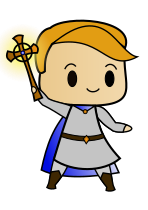

*Metodologías de Diseño y programación*

# Alpaca Emblem

Juego de estrategia por turnos. Dos equipos formados por distintos tipos de unidades se enfrentan en un mapa. El objetivo del juego es dejar fuera de combate a una unidad especial del equipo contrario, llamada *Héroe*. Las unidades pueden equipar distintos ítems, y utilizarlos durante el combate. Los ítems tienen debilidades y fortalezas entre ellos.

## Reglas

### Unidades
Actualmente el juego cuenta con 6 tipos de unidades, las cuales comparten las siguientes características:
- **Hit points:** Es la cantidad de daño que puede recibir la unidad antes de quedar fuera de combate (i.e. la unidad no puede seguir utilizándose y deja el campo de juego). Para esto, se tienen 2 contadores: uno que indica
los hit points máximos de la unidad, y otro que indica la cantidad actual.
- **Movement:** Representa la cantidad máxima de celdas del mapa que puede desplazarse una unidad. Esto significa
que en cada turno una unidad puede ubicarse en cualquier posición del mapa que se encuentre entre 0
y *movement* celdas de distancia desde su sitio actual.
- **Location:** Es la ubicación actual de una unidad en el mapa.
- **Items:** Es una lista con los objetos que porta la unidad. Además, dependiendo del tipo de objeto, algunas unidades podrán equiparse alguno de estos.

Exceptuando la Alpaca, todas las unidades pueden portar a lo más 3 objetos.
Los tipos de unidades se listan a continuación:
- Unidades básicas:
  - **Archer:** Sólo pueden equiparse *Bows*.  
  - **Fighter:** Sólo pueden equiparse *Axes*. 
  - **Sword Master:** Sólo pueden equiparse *Swords*. 
- Unidades especiales:
  - **Alpaca:** No pueden equiparse ningún tipo de objeto, pero pueden cargar una cantidad ilimitada de ellos. 
  - **Cleric:** Sólo pueden equiparse *Staffs* y no pueden realizar ataques. 
  - **Hero:** Sólo puede equiparse *Spears*. Al ser derrotado, el jugador que perdió esta unidad pierde la partida (esto no está implementado aún).

### Objetos
Los objetos son elementos que una unidad puede ocupar sobre otra. Para ocupar un objeto, la unidad primero debe equipárselo. Cada objeto tiene un rango definido en [*minRange*, *maxRange*] y sólo pueden utilizarse en unidades que estén dentro de ese rango. El rango de un objeto está acotado inferiormente por 0 y el máximo debe ser estrictamente mayor que el mínimo.

### Mapa
El mapa se puede pensar como una grilla de dimensiones , en la que cada casilla puede ser parte del mapa o no.
Más específicamente, el campo de juego se define como un grafo en el que cada nodo representa una celda del mapa. Las celdas pueden estar o no conectadas a otras celdas. Una celda está conectada a otra si son adyacentes: por ejemplo, la celda  puede estar conectada con la , referenciándose la una a la otra como vecinas, pero no podría estar conectada con la celda .
La distancia entre todos los nodos que están directamente conectados es 1.

## Detalles de la Implementación

**Agregar diagrama UML**
- Para tratar con los distintos tipos de ítem se utiliza Double Dispatch.
- Se crea una clase <code>NullItem</code> (que no hace nada), que implementa la interfaz <code>IEquipableItem</code>. Se utiliza para tratar con las unidades que no tienen un ítem equipado. Tiene rango [0,0], y <code>power</code> 0.
- Las unidades no equipadas son vulnerables: recibirán daño aumentado. La Alpaca, por tanto, siempre recibe más daño.
- Se tiene una interfaz <code>IEquipableItem</code>, que define el comportamiento de un ítem estándar. Esta se implementa en la clase abstracta <code>AbstractItem</code>. Esta clase, a su vez, se separa en dos clases abstractas <code>AbstractWeapon</code>, para ítems que pueden atacar y que pueden reaccionar a ataques con un contrataque (como <code>Bow</code> o <code>Axe</code>), y <code>AbstractHealer</code>, para ítems que pueden sanar, pero que no pueden contratacar (como <code>Staff</code>).   
- Para el combate, se agregaron los métodos <code>actOn</code> and <code>reactTo</code> en <code>AbstractItem</code>, simplemente dejándolos en blanco (el comportamiento de un ítem por defecto). Se implementan en <code>AbstractWeapon</code> y <code>AbstractHealer</code> con sus correspondientes variaciones.
- Para manejar la muerte de las unidades se agrega una interfaz <code>IState</code>. Esta será implementada por las clases <code>Alive</code> and <code>Dead</code>, y permite ser extendido fácilmente a otros estados como  <code>Confused</code> or  <code>Paralysed</code>.
## Descripción de los tests

### Tests de <code>IUnit</code>

#### Inventario
Test para el correcto manejo de los ítems en inventario.
- <code>addItemTest()</code> chequea que los ítems se agregan correctamente.
- <code>addItemMoreThanMaxTest()</code> chequea que no se agregan más ítems del máximo.

#### Equipar ítems correctamente
Se testea que cada una de las clases solo pueda equipar el tipo de ítem que le corresponde (e.g. <code>Archer</code> solo puede equipar <code>Bow</code>, etc). Se implementaron los siguientes tests.
- <code>equipAxeTest()</code>
- <code>equipSwordTest()</code>
- <code>equipSpearTest()</code>
- <code>equipStaffTest()</code>
- <code>equipBowTest()</code>

Su comportamiento depende de la clase. Se testea que las clases equipen exitosamente su ítem correspondiente, y que no hagan nada al intentar equipar un ítem incorrecto.

#### Intercambio
- <code>successfulExchange()</code> verifica que una unidad puede entregar un ítem de su inventario a otra, y que el <code>owner</code> del ítem cambia.
- <code>notGiveAwayItemNotOwned()</code> verifica que no se pueda entregar un ítem que no está en el inventario.

#### Movimiento
- <code>testMovement</code> verifica que una unidad no puede moverse a una celda que esté a una distancia mayor que su capacidad de movimiento, que es capaz de moverse a una celda válida, y que no se mueve a una celda ocupada por otra unidad.

### Tests de Combate
Se crea la clase abstracta <code>CombatTest</code>, donde se implementa un campo de batalla con todas las unidades disponibles, a distancia 2 de una unidad de prueba <code>testUnit</code> (que cambiará en las diferentes extensiones de <code>CombatTest</code>). Las posiciones usadas se muestran en la imagen:

La idea es que <code>testUnit</code> ataque (o sane, si el el caso) a todas las unidades a su alrededor.
- En el test <code>useItemOnUnEquippedTargetUnitsTest</code> ninguna unidad objetivo está equipada, por lo que deben recibir daño aumentado.
- El test <code>equipTargetsAndUseItemOnEquippedTargetUnitsTest</code>, las unidades objetivo son equipadas antes de ser atacadas. Se verifica que los <code>currentHitPoints</code> coinciden con lo esperado al considerar fortalezas y debilidades entre armas. 
- El test <code>distanceTest</code> verifica que las distancias a las diferentes unidades son las correctas.
- El test <code>isInRangeTest</code> verifica que <code>testUnit</code> considera a las unidades objetivo dentro de su rango de ataque. En las diferentes clases que implementan <code>CombatTest</code> se cuida de asignar a <code>testUnit</code> un arma que pueda atacar a unidades a distancia 2.
